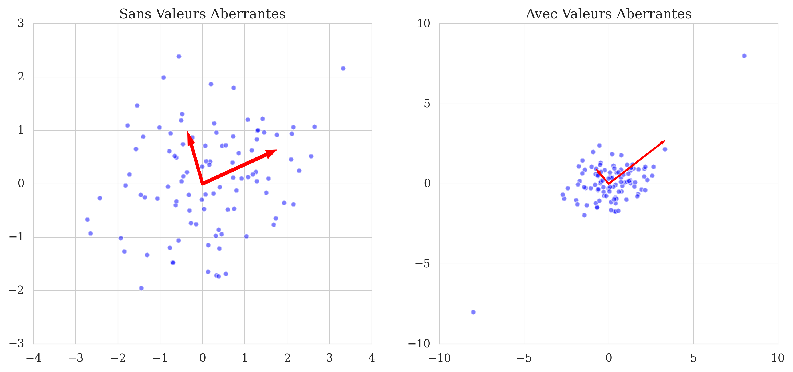

# Analyse des composantes principales (ACP)

Ce projet de fin d’étude présente l’Analyse en Composantes Principales (ACP) appliquée à des images, avec implémentation en Python et évaluation quantitative (PSNR, SSIM).

---

## Table des matières

- [Description](#description)
- [Prérequis](#prérequis)
- [Installation](#installation)
- [Structure du projet](#structure-du-projet)
- [Usage](#usage)
- [Exemples de résultats](#exemples-de-résultats)
- [Contribuer](#contribuer)
- [Licence](#licence)

---

## Description

L’ACP est une méthode de réduction de dimensionnalité linéaire qui projette des données dans un sous-espace de dimension réduite tout en maximisant la variance expliquée. Ce projet :

- Maîtrise les fondements théoriques de l’ACP (covariance, SVD, multiplicateurs de Lagrange, etc.).
- Implémente l’ACP sur des images (image haute résolution et base ORL) via des scripts Python.
- Évalue la qualité de reconstruction par PSNR et SSIM en fonction du nombre de composantes principales.

---

## Prérequis

- **Langage & IDE**  
  - Python 3.x  
  - VS Code (ou tout éditeur de code de votre choix)
- **Bibliothèques Python**  
  - `numpy`  
  - `scipy`  
  - `scikit-learn`  
  - `matplotlib`  
  - `scikit-image`  
- **OS**  
  - macOS (Intel/ARM cores, 32 Go RAM ou plus)

---

## Installation

1. Cloner ce dépôt :  
   ```bash
   git clone https://github.com/votre-utilisateur/votre-repo.git
   cd votre-repo
   ```
2. Créer et activer un environnement virtuel (recommandé) :  
   ```bash
   python3 -m venv venv
   source venv/bin/activate
   ```
3. Installer les dépendances :  
   ```bash
   pip install -r requirements.txt
   ```

---

## Structure du projet

```text
.
├── data/                # Jeux de données (images originales)
├── images/              # Figures et outputs (pca_*.png, geometric, outliers, etc.)
├── python/              # Scripts Python pour l’ACP et métriques
│   ├── pca_code.py      # Script principal de réduction de dimension
│   ├── metrics.py       # Calcul PSNR et SSIM
│   └── ...
├── requirements.txt     # Liste des dépendances Python
└── README.md            # Ce fichier
```

---

## Usage

1. Ouvrir VS Code ou votre terminal.
2. Activer l’environnement virtuel si nécessaire :  
   ```bash
   source venv/bin/activate
   ```
3. Lancer les scripts pour exécuter l’ACP et générer les figures :  
   ```bash
   python python/pca_code.py --input data/original.png --output images
   ```
4. Pour calculer PSNR et SSIM :  
   ```bash
   python python/metrics.py --original data/original.png --reconstructed images/pca_50.png
   ```

---

## Exemples de résultats

**Géométrie de l’ACP**  


**Échec sur données non linéaires**  


**Impact des outliers**  


**Reconstruction d’une image haute résolution**  
| Original | k = 100 | k = 50 | k = 25 | k = 10 |
|:--------:|:-------:|:------:|:------:|:------:|
|  |  |  |  |  |

**Taille vs Qualité**  


**SSIM - Structural Similarity Index Measure**  


---

## Contribuer

Les contributions sont les bienvenues !  
1. Forkez le projet  
2. Créez une branche (`git checkout -b feature/ma-fonctionnalité`)  
3. Committez vos changements (`git commit -m 'Ajout d’une fonctionnalité'`)  
4. Poussez (`git push origin feature/ma-fonctionnalité`)  
5. Ouvrez une Pull Request

---

## Licence

Ce projet est sous licence MIT. Voir [LICENSE](LICENSE) pour plus de détails.
